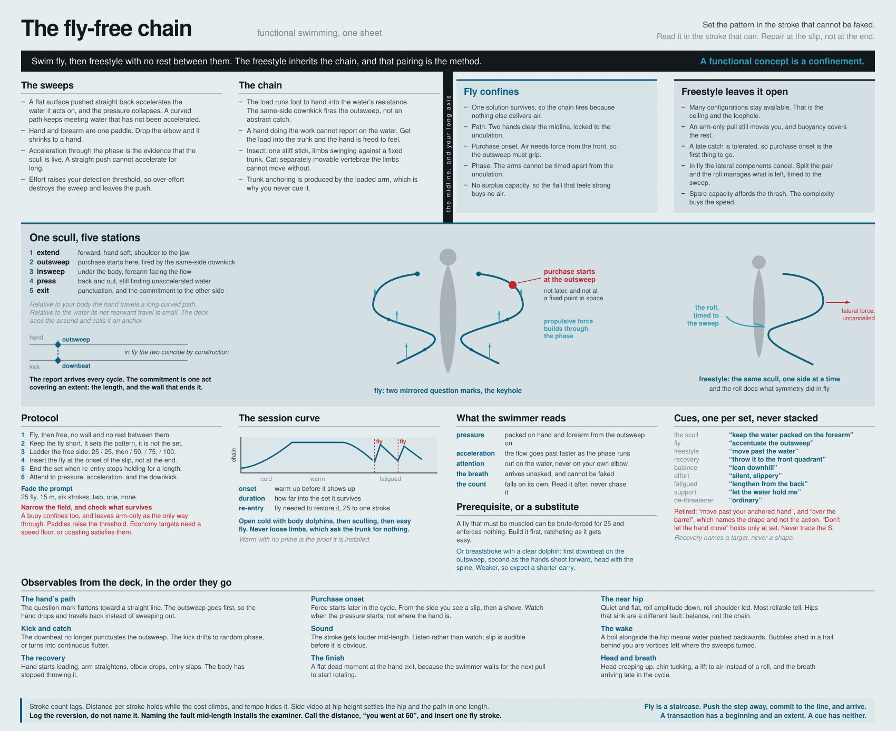

# Functional swimming: the fly-free chain

Swim butterfly, then swim freestyle without a break, and the freestyle inherits the kinetic chain. That pairing is the method. Everything below either explains why it works, tells you how to run it, or lists the small amount of apparatus that still earns its place beside it.

Two rules hold throughout. When a technique cue and a functional concept conflict, the functional concept wins. And you run one thing at a time, never a stack.

## Prerequisite

The method assumes a fly you can already swim easily, at regulated effort, for as long as you want, or the substitute described at the end of this section. This reference is written from a fly built up over years to a mile, swum in lengths, with effort regulated throughout and rest taken in the glide when winded. Everything downstream depends on that, so it is worth stating before the mechanism rather than after it.

The dependence is mechanical rather than a matter of fitness. At distance, fly cannot be muscled, so the chain is what is doing the work and the enforcement described below is genuine. A short fly at high effort is a different animal. Twenty-five yards can be brute-forced on arms and shoulders, which is enough to reach air and not enough to enforce anything, and the high effort raises the detection threshold, so even a fly that surfaces reports nothing readable. A fly like that sets no pattern, and the pairing then has nothing to pair.

*Rest lives inside the stroke.* After the hands re-enter, rest in the glide: lengthen from the toes, hang in rag doll, and let the forward hands act as rudders holding the line while you decide the pace. It is a hang rather than a held shape, and nothing in it asks anything of the abdominal wall. That is how fly gets extended without becoming continuous effort. The distance is not bought by holding on longer; it is bought by having a resting station inside the cycle.

*Building it.* Short and easy with full rest between, the glide established early so the rest has somewhere to live, one-arm fly with the idle arm extended forward, and body dolphin as sub-fly. Then ratchet the distance up as it gets easy, through 200, 400, 800 and 1600. Effort regulated at every stage. Volume built faster than that is where the shoulder goes.

Whether the pairing transmits to someone who reaches an easy fly by a different route is untested. What is certain is that it does not transmit to someone who has no easy fly at all, because the confinement is the whole mechanism and a fly that must be fought is not one.

### The substitute imprinter

Breaststroke arms with a dolphin kick, which is the stroke butterfly grew out of before the recovery came over the water, will imprint the chain when fly is not available. It works, and it works less emphatically, and the reason is identifiable rather than a matter of degree.

*What it keeps.* The undulation is short-axis and the arms are symmetric, so the lateral components cancel exactly as they do in fly. The pull is a scull, more explicitly than in any other stroke, and purchase starts at the outsweep. The kick can fire that outsweep. The glide gives rest inside the stroke, so the distance is available.

*What it loses.* Fly's enforcement is that the whole arm recovery has to clear the water, which demands real elevation and cannot be had from the arms alone. Breaststroke recovers underwater, so the air requirement is mild: a modest pull and a head lift will get you a breath. The enforcement is not absent, it is cheap to satisfy, and surplus capacity remains for confirmation-effort to hide in.

Two escape routes therefore stay open. Lifting the head instead of loading the chain, and a token dolphin that undulates nominally while the arms do the work. Both have to be closed by specification, and that is a real cost, because a specification is a cue and cues constrain appearance rather than narrowing the field. The two requirements are that the dolphin be clearly articulated, two down beats per cycle with the first coinciding with the outsweep and the second as the hands shoot forward; and that the head stay with the spine, so the air comes from the body rising rather than from the neck.

*What it gains.* Lower force, which lowers your detection threshold and makes the report more readable, and much lower shoulder load, since nothing is thrown over the water. It sits between fly and freestyle on both axes: weaker enforcement, better resolution.

| Component | Fly | Breaststroke with dolphin |
|---|---|---|
| Lateral cancellation | enforced | enforced |
| Purchase at the outsweep | enforced | enforced, and more explicit |
| Kick-to-outsweep phase lock | obligatory | available, has to be specified |
| Chain transmission | mandatory | strongly favoured |
| Forearm as part of the paddle | nearly forced | weakly encouraged |
| Confirmation-effort audit | one per cycle | weak, surplus capacity remains |
| Readability of the report | coarse, high force | better, lower force |
| Shoulder load | high | low |

*The recovery height is the dial.* Bring the arm recovery progressively out of the water and the elevation demand rises with it, restoring fly's enforcement by degrees. That is the path the stroke took historically, which makes the substitute the first rung of a ladder rather than a dead end.

Expect a shorter carry and a higher re-entry cost than fly gives. Both are visible in the three numbers, so the substitution can be checked rather than assumed, and if raising the recovery lengthens the carry, the elevation-demand account is confirmed.

## The sweeps

The stroke is a scull. The hand extends forward, sweeps out and slightly down, sweeps in under the body, then presses back and out to the finish. Relative to the body that path traces an S, or a question mark. Purchase with the water starts at the outsweep, not at some later moment when the pull "begins."

Two reference frames are in play and confusing them is the source of most bad cues. Relative to your body, the hand travels a long curved path. Relative to the water, its net rearward displacement is small, because you are moving forward past it. Both descriptions are true at once. The deck sees the second one and calls it an anchor.

The curve is not stylistic. A flat surface pushed straight back accelerates the slug of water it acts on, and once that water is moving with the hand, the pressure differential collapses and you are dragging your own wake. A curved path keeps presenting the hand and forearm to water that has not yet been accelerated, which is what sustains pressure across the whole phase. Whether you book that as lift or as unsteady drag is a modelling choice that changes nothing about what you do.

The effective surface is hand and forearm together, which is the whole content of the high elbow. Drop the elbow and the forearm stops facing the flow, so the paddle shrinks to a hand.

*Acceleration is the evidence that the scull is live.* Only a surface that keeps finding still water can keep accelerating. A straight push cannot accelerate for long, because the water it is pushing is already going. So the acceleration you feel through the propulsive phase is not a separate signal sitting beside the sweep. It is the sweep, reporting.

That also sharpens the effort argument. A scull is steered by pressure feedback; a straight push needs no information to run. Effort raises your detection threshold, so over-effort does not degrade the stroke evenly. It destroys the sweep specifically and leaves the push.

## The chain

What grips is a kinetic chain loaded foot to hand into the water's resistance, and not a held position. Feel the whole line grip so the body shares the load and the arm never bears it alone.

The same-side downkick fires that chain, and it fires the outsweep in particular. Naming the ignition precisely matters, because "the catch" is vague enough to be timed anywhere, and in a stroke that has gone wrong it is timed late.

A hand doing the work cannot report on the water, because one surface cannot serve as an instrument of force and an instrument of sense at the same time. Get the load into the trunk and the hand is freed to feel.

The fault this replaces has a shape. A spine can work as one stiff stick from pelvis to head, so all the movement is limbs swinging against a fixed trunk and nothing ever alters the distance between shoulder and hip. That is the insect version, and it is the commonest fault in a freestyle stroke. The cat version is a column of separately movable vertebrae that requires the trunk and head to join in, because the limb movement is not available without them.

The trunk connection is produced by the pull, which is why you never cue it. The abdominals mobilize to anchor the chest to the pelvis because the arm is loaded, and that anchoring is a transient requirement of a loaded arm rather than a state to maintain. Hold it continuously and it has stopped serving the pull and started stopping your ribs. Held trunk flexion and a free breath are not compatible, which is the whole case against carrying a core shape while swimming.

## Functional concepts

A *functional concept* is a confinement. It narrows the field of available solutions until the one you want is the only one left, and the body then finds it without being told. Efficient recruitment is what remains once the alternatives are gone, which is why efficiency is never something you aim at. Pointing attention outside yourself is how a confinement gets built rather than the mechanism itself.

A *cue*, by contrast, is something you hold in mind and check against. "Back of neck lengthened." "Hand outside the shoulder." Holding one costs continuous vigilance, turns attention inward, and produces the stiffness that inward attention always produces.

### Committing early is the act that closes the field

The early weight shift in a mogul run is not a timing preference. It is the moment the options collapse. Commit down the fall line at the top of the turn and the legs have one job. Hedge, and you hold three futures ready at once, turn, brake, or go, and holding several programs in readiness is the expensive thing.

Confirmation-effort therefore has a cause rather than only a description. It is the price of keeping options open. The supplementary work is not confirming that the movement happened; it is maintaining the escape routes you declined to close.

Keeping futures ready also has a physiological signature: flexors contracted and extensors inhibited, which is the anxiety pattern and equally the shape of a braced, non-extending stroke. Hedging and bracing are one event, so a confinement removes the trigger instead of overriding it.

*Poise* is what a narrowed field feels like from inside. Nothing is held in reserve, because nothing else is going to be asked for.

A shape that a good movement passes through is a *fossil of a function*, and not a position to hold. The elite flyer's poised catch, forearms draped and elbows high, is what an organized pull looks like at one instant, frozen by a camera that stopped a transition. He is passing through it at the point of most mechanical advantage and least muscular holding. You install poise by running the function. Arranging your elbows to match the photograph installs nothing.

### The extent of a transaction

**A transaction has a beginning and an extent. A cue has neither, which is why it has to be held.**

The report and the commitment run at different rates, and conflating them puts the decision back. Fly's enforcement arrives every cycle, but that is the report, and reading is free. The commitment is one act covering an extent, and re-deciding it stroke by stroke re-opens the field, which is what the confinement was for. Good fly is one thing you entered. Bad fly is a series of efforts.

A flight of stairs is committed as a flight, not renewed on every step. The unit comes from the terrain rather than from the stride, which is why a tall stairwell is climbed a flight at a time and the landings are where the transaction ends.

A fall line needs three things, and the interesting cases are the ones missing a part.

| | Direction | Extent | Report |
|---|---|---|---|
| Stairs, ascending | gravity | the flight | arrive on the step or not |
| Fly | gravity, short axis | the length, ended by the wall | air |
| Freestyle in a pool | gravity, long axis | the length, ended by the wall | pressure, acceleration |
| Walking on the flat | gravity and heading | none given | footfall noise |
| Open water | gravity, long axis | none given | pressure, acceleration |

A direction is not a line, because a line has ends. Stairs and a pool length hand you both. Flat ground and open water hand you a direction and leave the extent unspecified, and an unbounded transaction has nothing to complete, so it decays into monitoring or into drift. There you supply the extent yourself, with a destination: the far end of the corridor, the tree, the headland, the stretch of shore. Setting the extent is that instruction's entire job.

The wall is terrain punctuation, which is why the length is the natural unit in a pool and why pushing off without a purpose wastes the one boundary the pool gives you. A mile of fly is not one transaction; it is sixty-four of them, each ended by a wall.

This also gives a second reason to keep the fly short, independent of the shoulder. A confinement is a narrowing, and narrowings are bounded by nature, so the method uses short ones repeatedly rather than trying to build a long one.

*The failure mode is not forgetting to renew.* It is never having entered. Effort spread evenly across the flight, or continuous lifting held between steps, is the monitoring version wearing the new vocabulary, and it goes to heat. The tell is the effort profile of the organizing rather than of the work. The work is distributed by physics, since every stair genuinely lifts your mass. The organizing is one act at entry, and if that feels evenly spread, you are holding a direction rather than having committed to a line.

### Why monitoring cues cannot confine

A monitoring cue constrains appearance and leaves the solution space untouched. "Hand outside the shoulder" is satisfiable by any recruitment pattern at all, including the one you are trying to lose. That is why sweet spot can be completed cleanly with an insect spine, and why the S-pull teaching failed: it constrained the shape of the path while leaving open every way of producing it.

Stacking is the same error multiplied. Three cues are three constraints on appearance, which is supervision load rather than confinement. One confinement does more than any number of them.

### The two-part criterion

Confinement alone is not the goal. A pull buoy confines: it removes the kick and leaves an arm-only solution as the only way through, which is why it trains the wrong thing so efficiently. The test has two parts. The field must be narrow, and the surviving solution must be the one you want.

So to train anything, do not propose it. Find or build a confinement in which it is the only way through. This is the constraints-led approach in the motor learning literature, and behind it Bernstein's problem of managing degrees of freedom.

### The deceleration loophole

A score is not a functional concept. Stroke count and swim golf point outward, which is in their favour, but they constrain the outcome and leave the solution space untouched. "Fewer strokes" is satisfiable by reaching and waiting, by hauling harder, by holding a streamline, or by sculling wider to grab more water. Most of the available solutions are worse than what you had, and the cheapest one is the front-end glide.

Striving for a low count is therefore aiming at the fossil, which is the same error as tracing the S or posing the drape. Any measurement of a good movement, promoted to a target, produces a caricature of the movement.

The count is arithmetic on extent. It is the number of transactions per length, so a lower count means fewer and longer transactions, each covering more ground. The cheat reaches the same number by a different route: the same short transactions with more dead space between them. The count cannot tell the two apart. That is why the concept behind a falling count is not the count at all but riding the grip longer, lengthening from the back rather than reaching at the front, and why holding the time is mandatory whenever the count is used. Dead space costs time.

The loophole generalizes. Count, noise, effort, heart rate and perceived exertion all improve if you slow down and coast, so deceleration is the universal escape route from an economy target. An economy target becomes a confinement only when paired with a speed floor. Held time with falling strokes is a genuine two-sided confinement, because the pair excludes the deceleration solutions and leaves making each stroke carry more as nearly the only way through.

Silence is a different animal, and better. Noise is a continuous report on turbulence rather than an outcome score, it is available every instant, it cannot be faked as a shape, and making less of it is a real effect on the world. It also lowers your detection threshold and buys back the resolution the sweep runs on, which the count does nothing for. Silence still has the same loophole, since a glide is silent, so it needs the pace partner too. The ranking is silence at pace, then golf with the time held, then count alone, which is actively harmful.

### The fall line, and stairs

The *fall line* is the gravitational line the movement runs along. Ascending, it runs forward and up. Swimming, it runs forward and slightly down, along the line you tip onto when you swim downhill.

Going up a staircase is the clearest case. The functional concept is to push the step away while committing to the ascending fall line, and it recruits the extension chain from foot through trunk without naming a single body part. What makes it clean is that the task admits no noncommittal version. Put your weight over the new foot at the outset and the step delivers you, because nothing else can produce that outcome. Hedge, and you are hauling yourself up, which is expensive and immediately obvious.

Confirmation-effort has nowhere to hide on a staircase, because there is no way to manufacture the feeling of having climbed a step. You arrive on it or you do not.

### The fly is the same errand in water

Accentuate the outsweep while committing to the fall line, and the chain delivers the chest to air. The fall line here is short-axis rather than long: the chest goes down and over the water the forearms hold, and that fall is what lifts you. The report arrives once per cycle, which is the rate of the testing and not the unit of the commitment. What you commit to is the length, ended by the wall.

Inside that confinement the chain arrives easily and without instruction, because no other solution produces air. Fly has no surplus capacity either, so nothing is available for confirming the work rather than doing it, and the extra flail that makes a stroke feel strong buys nothing.

### Freestyle's openness is the feature

Freestyle cannot be fixed by confining it, and you would not want it confined. Many configurations stay available, which is the ceiling, and it is the same property that lets the cheap solution survive. Its fall line is continuous rather than discrete, so commitment can drift without any single moment reporting the drift.

The goal was therefore never to make freestyle a confinement. It is to make the chain the preferred solution inside an open field, which is slower work than enforcement, and it is why the pattern never simply stayed. You visit the confinement, and the open field gradually stops reaching for the bad option.

## Enforcement in fly, permission in freestyle

Fly and freestyle run the same scull. Fly runs it in parallel around the short axis, both arms sweeping together while the body undulates, and the keyhole is two mirrored question marks. Freestyle runs it alternately around the long axis, one side at a time while the body rolls. Same path, same chain, same ignition.

The difference is what each stroke tolerates.

In fly, an arm-only pull cannot lift the chest to air. The chain transmits foot to hand or you stall. The fault is not corrected in fly; it is unavailable as a solution. In freestyle at ordinary speed, an arm-only pull against a rigid trunk still produces forward motion, and buoyancy covers the rest. The insect version is a viable solution to the task, so the system has no reason to abandon it.

Three specifics are enforced in fly and merely permitted in freestyle.

*The path.* Two hands sweeping simultaneously constrain each other. They have to clear the midline, they cannot collide, and they are locked into the undulation's timing. The keyhole shape is not taught in fly; it is what two mirrored sculls have room to do.

*Purchase onset.* Getting the chest to air requires force from the front of the stroke, so the outsweep has to grip. A late catch fails immediately. Freestyle tolerates a late catch indefinitely, which is why purchase onset is the first thing to go.

*Phase.* The kick fires the outsweep, and in fly that coupling is obligatory, because the arms cannot be timed independently of the body's undulation.

Fly's feedback is air. It arrives every cycle, immediately, and needs no interpretation. "Did that feel connected?" is an interpretation, which is monitoring, which occupies the machinery. "I got the breath or I didn't" occupies nothing. Fly also has no surplus capacity, so any muscle firing out of role costs you the surface, which makes it a forced audit of parasitic effort at a rate of one audit per stroke. Freestyle has enough spare capacity to afford the thrash indefinitely.

One more asymmetry explains why freestyle is the harder stroke, and it follows from the sweeps rather than from a list of components. In fly the lateral components of the two sweeps cancel. Split the pair and one asymmetric question mark produces an uncancelled lateral force that something has to manage. In freestyle the roll manages it, which is why the roll has to be timed to the sweep rather than merely present. Fly gets that for free from symmetry. Freestyle buys it with a rotation you can mistime, and that is where both the difficulty and the speed come from.

## The pairing compared with drills

A drill proposes the correct pattern and asks you to run it, which leaves the old pattern available and makes the new one a proposal your system can refuse. Fly is a confinement: it imposes a task with one solution. You never intend the chain, and there is nothing to check.

Most freestyle drills also run at reduced load, and at reduced load nothing demands transmission. Sweet spot, catch-up and the switch ladder can all be completed cleanly with an insect spine and an arm-only pull. The drill trains the shape, and the shape is achievable without the chain. The deeper problem is that the chain is a whole-body relation, and isolating a relation destroys it. That is the same reason you do not audit the links. A drill isolates by construction.

Three further mechanisms belong to the pairing rather than to either stroke alone.

*Invariance.* The system extracts what stays constant across variants, and it cannot extract it from one variant repeated. Fly and free differ in axis, in symmetry and in left-right timing, and hold constant the load path and the ignition. Alternating them makes the chain the only invariant in the set, which is what makes it perceptible. Varying the distances raises that further. Blocked repetition of one drill produces good drill performance and poor transfer; interleaved variants produce the reverse.

*Resolution.* Fly is a loud, coarse signal: surfaced or stalled. Because high force degrades the report, fly can set a pattern but cannot let you feel small differences in it. Freestyle at ordinary effort is where the fine discrimination lives. Fly sets, free reads, and either one alone gives you half the instrument.

*Order.* Four things make fly-then-free different from free-then-fly. The most recently run organization is still warm, so the freestyle starts from a different initial condition and lands in a different basin. Fly is the pattern in which the chain is already allowed, which makes the free that follows the isolation step of smuggle-then-separate. Fly is the excursion and freestyle is home, so home inherits what the excursion found. And fly spends the arm-only budget, so when the brute-force pull is too expensive to run, the chain is what remains.

That last one has a ceiling. Enough fly to make the cheat expensive, not so much that excitation rises and discrimination collapses. The fly is the setter, not the workout.

The two axes have different natural frequencies, so what carries over is the coupling and not the cadence. Expect the freestyle immediately after fly to run at a different tempo, and do not hold fly's rate in it. Forcing a frequency that is not the long axis's own is the same error as over-kicking.

## Protocol

1. Swim the pair without a break. Fly, then free, no wall and no rest between them, so the transition happens under load in the same water.
2. Keep the fly short. It sets the pattern rather than being the set, and a narrowing is bounded by nature, so the method uses short ones repeatedly.
3. Ladder the free side: 25 fly / 25 free, then / 50, / 75, / 100. Log the length at which it reverts.
4. Vary the pairs across the session so no rhythm gets stereotyped.
5. Insert the fly at the onset of the slip, not at the end of the session. Do not cue; one fly stroke and continue.
6. End the set when re-entry no longer holds for a full length, rather than when the planned yardage is done.
7. Attend to the pressure through the sweep, the acceleration through the phase, and the downkick firing the outsweep. Nothing else.

*One-arm fly* is the exact halfway point: short-axis drive, obligatory undulation, breath still coupled, and an asymmetric load path, which is what freestyle is. Removing the mirror leaves the lateral force uncancelled while keeping the undulation, so it is the bridge to the roll's real job, and it exposes whether the chain transmits through one side.

Two conditions. Keep the idle arm extended forward rather than at your side, so the drape geometry and the front quadrant stay intact; arm at the side turns it into single-arm freestyle with a dolphin kick and hands the cheat back. And treat it as a probe rather than a staple, because asymmetric loading at fly intensity is where the shoulder gets hurt.

*The substitute runs the same protocol.* Where fly is not available, breaststroke with an articulated dolphin takes its place at every step above, with the phase requirement stated in "The substitute imprinter" and the expectation of weaker numbers. See "Prerequisite" above.

*Fade the prompt.* What you have after fly is a prompted behaviour, and repeating a prompted behaviour installs the prompt along with it. Cut the dose across weeks: 25 of fly, then 15 metres, then six strokes, then two, then one, then a couple of dolphin kicks off the wall, then nothing. Vary the entry alongside it, starting the freestyle from the wall, from a float, mid-length, and after a turn, so the pattern stops being bound to the fly-to-free transition. If the freestyle holds as the prompt shrinks, it is installing. If the free side of the ladder keeps growing while the prompt cannot be shortened, you are getting better at being primed.

*What not to use, and why.* A band or a pull buoy confines, which is the trouble with it. It removes the kick, which removes the ignition, and leaves the arm-only pattern as the only way through. Paddles raise hand force, which raises your detection threshold and kills the sensing the sweep runs on. Both pass the first half of the criterion and fail the second. What legitimately raises the cost of the cheat inside freestyle is pace that arm-only cannot sustain, held time with the stroke count forced down, breath restriction, and distance long enough to fatigue the arm alone.

*Tests that discriminate the mechanisms.* Run 25 fly / 50 free three ways: with no rest, with 20 seconds of rest between the fly and the free, and with the fly swum deliberately easy. If the rest kills it, the mechanism is priming and phase. If easy fly works as well as hard fly, it is constraint rather than fatigue. If neither matters much, check the plain warm-up confound by comparing against 50 free preceded by an equally hard 25 of freestyle.

## The session curve

The chain does not decay steadily from a primed state. It runs in three phases across a session, and each phase has a different cause and a different remedy.

*Cold, and nothing is there.* This is warm-up decrement and not forgetting. Nothing was lost overnight; what has to be re-established is the state the pattern runs in, and this pattern depends on that state for three reasons. Cold tissue transmits worse, and the chain is a mechanical transmission line through the trunk, so more of the load turns into heat between the foot and the hand instead of arriving there. Cold timing is sloppier, and the downkick-to-outsweep lock is measured in tens of milliseconds. Cold hands read less, because skin cooling reduces pressure discrimination directly, which leaves you steering the sweep with the instrument turned down and the push as the only available option.

Moving the limbs loosely to loosen up does nothing about a trunk that is not participating. It is the insect version with no object for attention. Open instead with a few gentle body dolphins, which ask the trunk to participate at almost no load and put no cold shoulder under strain, then sculling, which warms the hands and forearms and restores pressure discrimination at very little force, then easy fly. Warm-up decrement is recovered by trials rather than by minutes, so a warm-up that contains the pattern in low-load form shortens the cold phase.

*Warm, and the chain is there without a prime.* This is the phase that proves it is installed. Starting a set warm, with no fly in front of it, the chain runs. What is missing is not the pattern but access to it under two specific conditions, cold and fatigued.

*Fatigued, and it slips.* The fatigue is central rather than peripheral, and the evidence is that fly still works. If the trunk were out of gas, fly would fail first, since it demands the most from the trunk. Instead fly still runs and still restores the freestyle. What has run down is the organization that selects and steers the pattern, and the sensing that goes with it: excitation has raised your detection threshold to where the sweep is no longer steerable, so the push, which needs no information to run, takes the job.

The tactic that matches the phase is lengthening rather than fighting for the chain. Fatigue raises the threshold until the sweep is no longer steerable, so propulsion refinement is unavailable, and drag reduction is the one lever left that needs no pressure discrimination at all. Lengthen from the back by riding the grip longer, and watch the stroke rate: if the rate falls while you lengthen, it has become a front-end glide, which brakes in the pause and re-accelerates the whole body every stroke.

*Do not finish reverted.* Every length swum after the slip and before the repair is a repetition of the arm-only pattern, and repetition wears the pathway that makes alternatives less likely. Saving the fly for the last few laps spends the back half of the session practising the thing you are retiring. Put the fly in at the onset of the slip, and keep it short and easy there, because fatigued fly at volume is where a shoulder goes.

### Three numbers

- *Onset.* How much warm-up before the chain shows up. Falling means access is improving.
- *Duration.* How far into the set it survives. This is the boundary moving outward.
- *Re-entry cost.* How much fly it takes to bring it back, from 25 down to a single stroke. This tracks installation most directly, and it should reach the floor first.

Cold-start quality is a poor measure for this curve, because cold is dominated by tissue and skin temperature rather than by what you have learned.

Three qualifications hold for all three numbers. They differ per side, since a blind side that does not transmit reverts first while the other keeps going. They differ per tempo, so log the pace beside them. And they are undefined if the fly is itself arm-driven, since a fly with no enforcement sets nothing; working fly is a precondition rather than a variable.

The measurement is self-liquidating. Once the freestyle runs chained across your ordinary range, duration reaches the length of the set and the protocol has nothing left to say. Some boundary always remains, because the highest level of organization is what stress takes first, which is why even elite technique degrades at the end of a race. What training moves is where the boundary sits.

## Diagnostics

Four signals report whether the function is live. The first three you check or interpret; the fourth arrives on its own.

*Pressure through the sweep.* The water packs against the hand and forearm continuously along the path, and it packs from the outsweep onward. Slip means the chain is not loaded. What you are keeping is a pressure relationship and not a position.

*Acceleration through the phase.* The flow goes past faster as the phase runs. That is what a live scull produces and a slipping or straight-back push does not.

*Attention location.* While the function runs, attention is out on the water and the space. When it collapses back onto your own parts, your elbow height, your hips, whether you are moving past your hand, the function has died and monitoring has moved in behind it. Every level of motor control runs through the same equipment, so control shifts between levels and never shares them. You cannot yawn and chew.

*The freed breath.* When a reorganization takes, a deeper breath arrives unasked and the breath stops being an event you schedule around the stroke. You cannot produce it on purpose, which is why it is the one signal that cannot be faked into existence by wanting it. Never cut one short.

*Stroke count is a report, not a signal.* When the transactions lengthen, the count falls on its own, the way the deeper breath arrives on its own. Read it after the length and log it. Chasing it during the length invites the glide, and unlike the freed breath it can be produced on purpose, which is exactly what makes it a poor thing to aim at. See "The deceleration loophole" above.

## Observables from the deck

Reversion is a change in the load path, and the load path shows in the hand's trajectory and in the trunk long before it shows in effort or speed.

| Where to look | What reversion looks like |
|---|---|
| The hand's path | The question mark flattens toward a straight line. The outsweep disappears first, so the hand drops and travels back instead of sweeping out and setting. |
| Purchase onset | Force starts later in the cycle. From the side you see a slip, then a shove. Watch when the pressure starts, not where the hand is. |
| The near hip | Hips go quiet and flat, roll amplitude drops, and the roll becomes shoulder-led. Shoulder-to-hip distance stops changing. The most reliable single tell. |
| Kick and catch | The downbeat no longer punctuates the outsweep. The kick drifts to random phase or turns into continuous flutter. |
| Sound | The stroke gets louder mid-length. Listen rather than watch; slip is audible before it is obvious. |
| The wake | A boil of white water alongside the hip means the hand is pushing water backwards instead of holding it. Bubbles shed in a trail behind you are the other reading: vortices left where the sweeps changed direction. Hold that one loosely, since it is inferred from the unsteady-flow work rather than measured. |
| The recovery | The hand starts leading, the arm straightens, the elbow drops, and the arm slaps in. The body has stopped throwing it. |
| The finish | A flat dead moment at the hand exit, because the swimmer is waiting for the next pull to start rotating. |
| Head and breath | Head creeping up, chin tucking, a lift to air instead of a roll, and the breath arriving late in the cycle. |

Stroke count is a poor detector because it lags. Distance per stroke can hold while the cost climbs, and a swimmer will often hold the count by raising the tempo, which the count alone hides. Two cheap instruments beat it. Side video shot at hip height settles the hip question and the path question in one length. A fixed-pace repeat with heart rate or perceived effort logged catches the rising cost the count cannot see.

Log the reversion, do not name it. Calling the fault mid-length installs the examiner and hands attention back inward, which produces the fault you just named. Call the distance instead, "you went at 60," and insert one fly stroke as the re-entry.

The real instrument is the gap between the two reports. Have the swimmer log where they felt the acceleration go, and compare it with where you saw the hips quiet. If the swimmer's report leads yours, their discrimination is working. If yours leads theirs, they are swimming at an effort too high to read the water, and the fix is less force rather than more attention.

## Attention

A held position and a functional concept can produce the same shape. They are opposite acts, and the test separates them. To test any instruction, ask where it points attention. If at your body, it is a monitoring cue; find the action or target hiding behind it and use that instead. If at the water, keep it.

Two retirements follow from the sweeps.

*Move past your anchored hand* is gone. It names a relationship between two parts of you, so it points at your own hand, and held as an intention it converts into a question you cannot answer from inside. It also describes the wrong thing: the hand is not fixed in space, it is sweeping, and the small net rearward displacement is a ground-frame consequence of a working scull rather than a target you aim at. Move past the water instead.

*Don't let the hand move* survives only at the instant of set. Held across the phase it forbids the sweep, which is the opposite of the intended effect. The grammar was right and the relationship was wrong: keep a pressure, not a position. Say *keep the water packed on the forearm*, or *don't let the pressure go*.

*Over the barrel* goes the same way. It is the drape photographed at the moment of maximum advantage, so it names the shape at one instant rather than the action that produces it. What produces it is accentuating the outsweep, which is where purchase starts and what puts the chest in air. The cue and the mechanism coincide there, which is the mark of a functional concept rather than a picture. Keep the barrel only for someone with no fly at all, as a shape-recruiter.

The fossil error applies with special force to the path itself. The question mark is the fossil of a pressure-seeking hand. Drawn deliberately it produces a wide, slipping, decorative path. Never trace the S.

## Cues

Pick one per set, launch it, then leave yourself alone. Never stack them. Three cues are three constraints on appearance, which is supervision load rather than confinement, and a stack is a bid for simultaneous control the system cannot grant. Whichever level wins under pressure is the lower one.

| Purpose | Cue |
|---|---|
| The scull | "Keep the water packed on the forearm." Or "don't let the pressure go." |
| Fly | "Accentuate the outsweep." |
| Freestyle | "Move past the water." |
| Recovery | "Throw it to the front quadrant." |
| Balance | "Lean downhill." |
| Effort | "Silent." Or "slippery." |
| Fatigued | "Lengthen from the back." |
| Support | "Let the water hold me." |
| De-threatener | "Ordinary." |

That is the whole list, and the pairing is what replaced the rest of it. An effort intention recruits effort, often the wrong muscles for it, while a keep-this-relationship intention recruits the organization and produces the effort as residue.

*The recovery cue names a target, not a shape.* The arm hangs loose and stays free at every joint through the recovery, so it can move and adjust on the way over. What is specified is where it is going, the front quadrant or the downhill line, and nothing about what it looks like getting there. The old position checks, hand outside the shoulder, fingers below wrist below elbow, described a configuration that a thrown loose arm passes through. Carrying that configuration deliberately turns the recovery into a held shape, which is the fault the marionette was for.

*"Silent" needs a pace partner.* A glide is silent, so silence alone can be bought by slowing down. Hold the cadence while you hunt for quiet, or the cue rewards the thing it was meant to remove.

*The fatigue cue is a drag play, not a propulsion play*, which is why it is listed separately and used only in the fatigued phase. See "The session curve" above.

## Drills that still earn a place

| Tool | What it trains |
|---|---|
| Fly into free | The chain, the sweep path, and the kick-to-outsweep phase lock |
| Sculling, front, middle and back | The report, at a force low enough to read it |
| Sweet spot and switching sides | Balance, the roll, and the blind side |

That is the list. Everything else, including anything aimed at the catch, is redundant once the pairing is running.

The two survivors are there because the supersets structurally cannot do their jobs. The supersets run at aerobic force, and force raises the detection threshold, so they exercise the pattern without ever training the discrimination it steers by. That is sculling's job. And fly cancels the lateral force through symmetry, so the pairing installs the chain and the sweep while staying silent about the rotation. That is the balance work's job.

*Sculling in three places.* Small in-and-out sweeps with the hand angled to hunt for pressure, at very low force, with the hands parked in three positions: out in front of the head, under the chest, and down at the hip. Front sculling is the one everybody does, which is why feel tends to be good where the catch sets and to vanish later in the stroke. The arm sits at different leverage and a different angle to the flow in each position, and the same movement in a different orientation is a different pattern as far as your system is concerned. Find the water's pressure against a moving hand, then follow it as it recedes, keeping contact. It is support that moves away and a hand that stays with it, not a pressure you find and clamp.

*Sweet spot and switching sides.* Find the sweet spot on one side, mostly onto that side, tilted slightly toward the back, and kick there. Roll as a unit to the other side and back. Recover the arm as a loose-jointed throw toward the front quadrant, free to move at the joints on the way over rather than carried in a fixed shape.

Compare the sides for support rather than for correctness. A blind side is rarely weak muscle; it is a side where the water has gone quiet, so you brace, and the brace wrecks the balance. Go out into new range slowly and come home quickly.

Sinking hips is the plain failure signal, and it is a different fault from the one the pairing addresses. Hips that go quiet and stop rolling mean the chain has reverted. Hips that sink mean balance has failed. Same body part, two faults, and the second one is visible from anywhere in the building.

## Effort and the report

The smallest change in pressure you can detect is a fixed fraction of the pressure already present, about one fortieth. Your detection threshold rises with your own output, and past a certain force the water stops reporting and becomes something you are merely shoving. Feel is a budget you set every stroke, and silence is how you buy resolution back.

Much of the effort poured into a movement is not doing the work; it is confirming the work, manufacturing the sense that the movement is complete. It feels like the point because it produces the feeling of "done," which is why it stays invisible as waste. Its cause is in "Functional concepts" above: it is the price of keeping options open.

Engaging the fall line early is the cure, as in "Functional concepts" above. Commit to the line at the outset instead of hedging or probing at it, and the work finishes before the confirming effort is summoned. Early does not mean rushed; it means committing at the outset instead of waiting until you feel you must.

Effort that does not become movement has one other place to go. Work becomes motion or it becomes heat, and heat inside a body is wear. Confirmation-effort is therefore not only the waste in the stroke; it is the mechanism by which years of strokes injure a shoulder.

## Practice rules

Run one function per set, then launch and forget. Attention goes to the water, not to a checklist.

Expect the right amount to feel like an exaggeration. A habit distorts your sense of magnitude, so any correction away from it reads as a lurch to the far side. That report is the predicted one and not evidence.

Keep repeats short and rests real, and do nothing technique-related on the rest. Ordinary cadence beats slow, except when crossing into new range. Careful is fine; ceremonial is interference.

Release into support rather than into limpness. Finish imperfectly; you are allowed to reach the wall having lost it.

End on a keystone: one easy, quick, agreeable length that comes out of whatever the session found, taken for pleasure, after which you stop. The parts of the brain doing the programming tire before the muscles do, so keep the learning block to about thirty-five to forty-five minutes and leave room for it.

## Training numbers

Economy is the goal. Physiological capacity is finite, while the room to swim a given speed more cheaply is effectively unlimited.

- Gears: roughly 11, 13 and 15 strokes per 25 yards, or 13, 15 and 17 per 25 meters.
- Pulse set: 8 to 12 repeats of 25, or 6 to 8 of 50, easy to moderate, resting 10 to 25 seconds, one cue for the whole set.
- Supersets for longer aerobic work, one or two per session. Fly opens, free blocks descend, and a fly re-entry sits between them:
  - Super 500: 25 fly / 150 free / 25 fly / 125 free / 25 fly / 100 free / 25 fly / 25 free
  - Super 1000: 50 fly / 300 free / 50 fly / 250 free / 50 fly / 200 free / 50 fly / 50 free
  - Super 2000: 100 fly / 600 free / 100 fly / 500 free / 100 fly / 400 free / 100 fly / 100 free
- Swim golf, as an occasional measurement rather than a set: hold the time and subtract strokes, scoring 30 strokes plus 50 seconds as 80. The time must be held or the number means nothing. Log heart rate beside the score, and log whether the same movement now takes a smaller push. Onset, duration and re-entry cost measure what matters better, so golf is a cross-check and not a training intention.
- Session shape: warm up with body dolphins and sculling, run a superset as the main set, add balance and switching work when the blind side needs it, and finish on a keystone.

The free blocks descend because duration shrinks as the session runs. The printed distances are a starting guess; replace them with your own duration numbers once you have them, and cut the set when re-entry stops holding rather than finishing the yardage.

Holding the time while dropping strokes forbids the front-end glide, because a glide decelerates in the pause and wrecks the time. The only way to satisfy both numbers is to make each stroke carry more.

## Summary

The stroke is a scull that starts gripping at the outsweep, fired by the same-side downkick, loaded foot to hand. Fly runs it in parallel and enforces every part of it, because an arm-only pull cannot lift the chest to air. Freestyle runs the same scull one side at a time, tolerates the fault, and pays for its extra complexity with speed.

So you set the pattern in the stroke that cannot be faked, then read it in the stroke that can. Warm, it runs without a prime, which is the evidence that it is installed. Cold and fatigued are access problems with different causes: cold tissue and cold hands in the first case, a threshold raised past the point where the sweep can be steered in the second.

Log onset, duration, and re-entry cost. Open with easy fly rather than with freestyle swum loose. Repair at the onset of the slip rather than at the end of the session, by inserting one fly stroke rather than by naming anything.

A functional concept is a confinement, and efficient recruitment is what is left when the alternatives are gone. A transaction has a beginning and an extent; a cue has neither, which is why it has to be held. Fly is a staircase: push the step away, commit to the fall line, and arrive on the step. No version of it hauls itself up while feeling busy.
